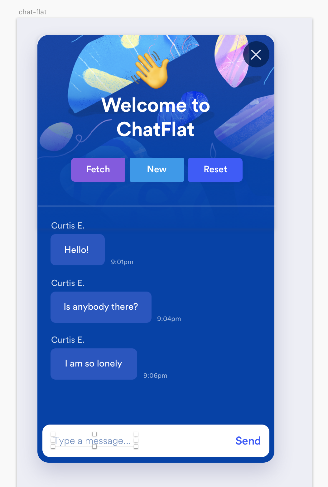

# Chatflat Tech Challenge

This is the starter project to be worked on during the Frontend (design team) technical interview. This project should be used to determine a candidate's technical skill as related to `HTML`, `CSS`, `React` and `JavaScript`.

It is meant to be used as a platform for discussion. The candidate is encouraged to ask questions, provide opinions and feedback at all times.

Use of [Google](https://google.ca) is allowed.

## Goals

- Style the UI as close to the mockup provided below.
- Make incremental improvemnts to the React app to create a better UX.

## Setup

### Install the dependencies

``` bash
npm install
```

### Launch the project

``` bash
npm start
```

## Current Mockup

